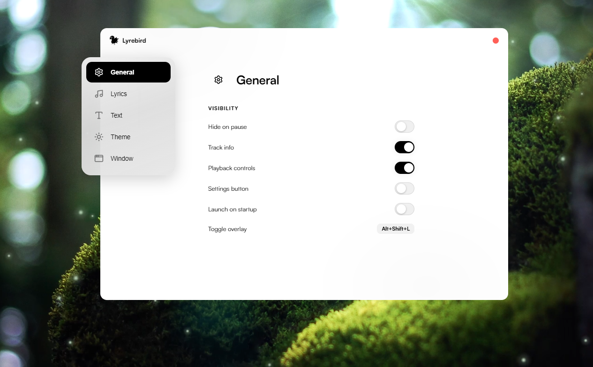
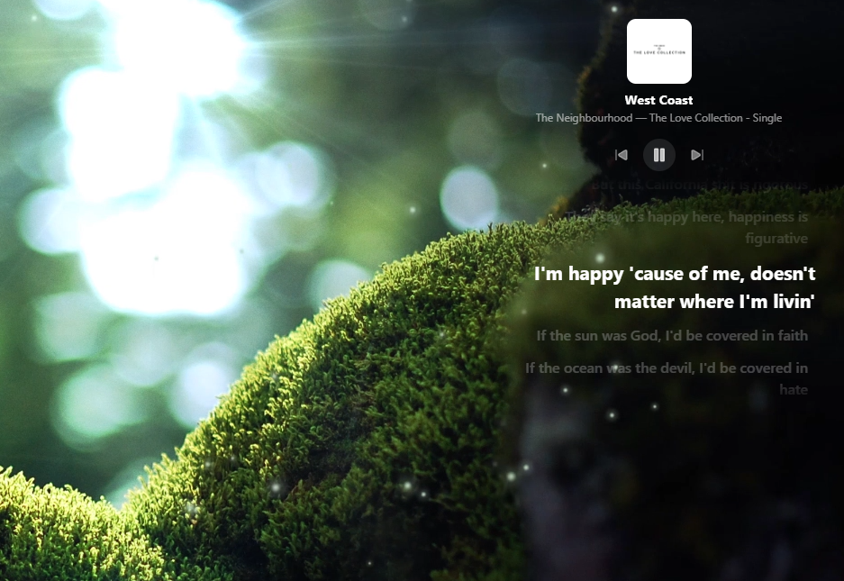

<p align="center">
  
</p>

Desktop lyrics overlay for Windows. Displays synced lyrics on top of your screen while you listen to music.

Works with any media player that supports Windows SMTC (Spotify, Apple Music, Tidal, etc.).

## Features

- Synced lyrics overlay with smooth scrolling
- Lyrics fetched from [LRCLIB](https://lrclib.net) (community database)
- Transparent, always-on-top window with customizable position and size
- Media controls (play/pause, skip)
- Track info display with album art
- Full settings panel: fonts, colors, blur, opacity, border radius, padding
- System tray integration
- Launch on startup
- Toggle overlay with `Alt+Shift+L`

## Screenshots

<p align="center">
  
  <br/><br/>
  
</p>

## Prerequisites

- [Node.js](https://nodejs.org) (v18+)
- [.NET 9 SDK](https://dotnet.microsoft.com/download/dotnet/9.0) (for the media bridge)

## Development

```bash
npm install
npm run dev
```

## Build

```bash
npm run package
```

Produces a portable `.exe` in `dist/`.

## Stack

- Electron
- React + TypeScript
- Vite
- .NET (SMTC media bridge)
